# Sports and Gym Landing Page
Patika+ programme project. A landing page for a sports and gym website. The project is built with HTML, CSS, and JavaScript. The project is responsive and mobile-friendly (for max-width 576px only).

See how the landing page looks when live: https://youtu.be/4_1Z9qbUWAY

## Desktop
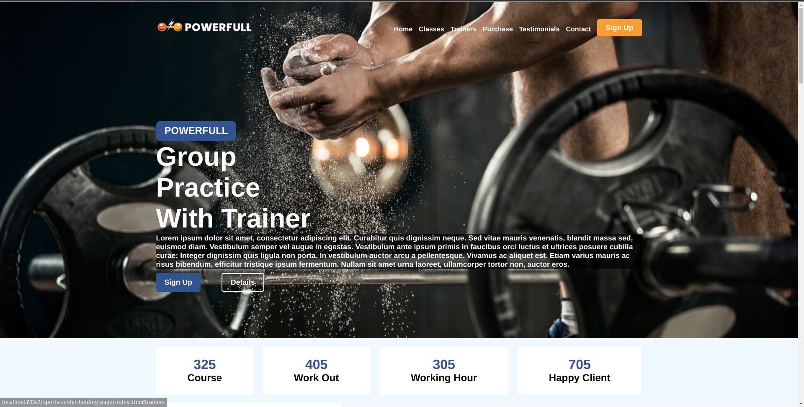
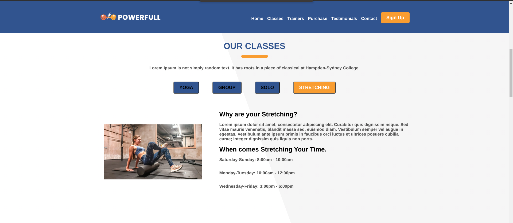
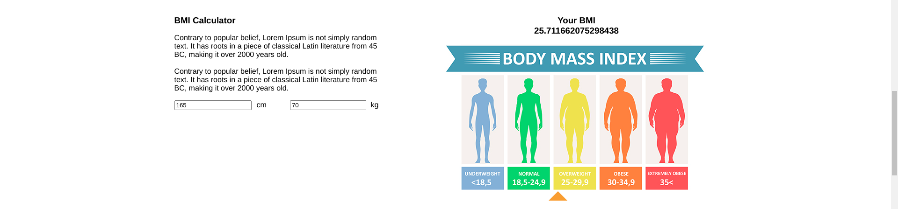
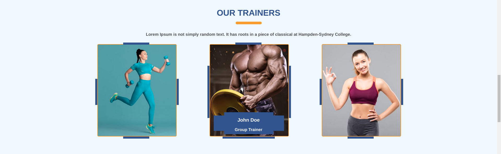
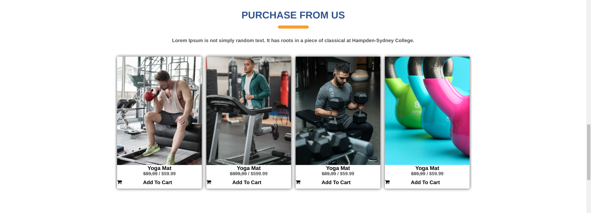
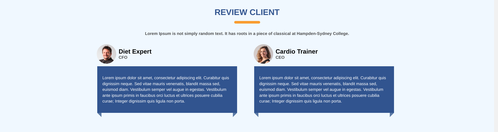
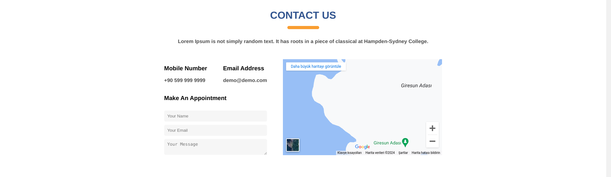

## Mobile
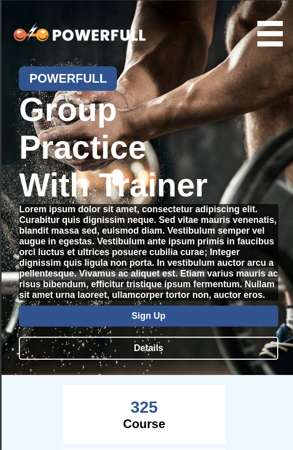
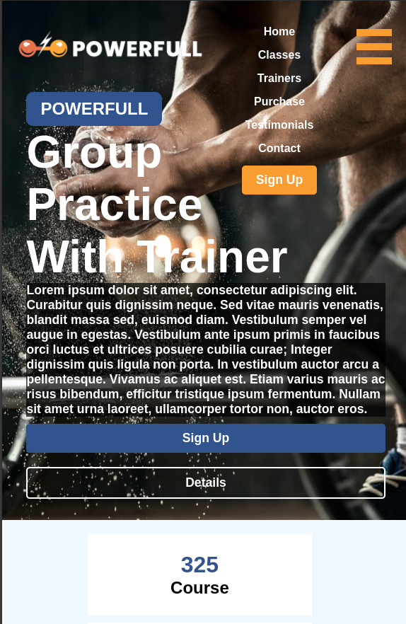
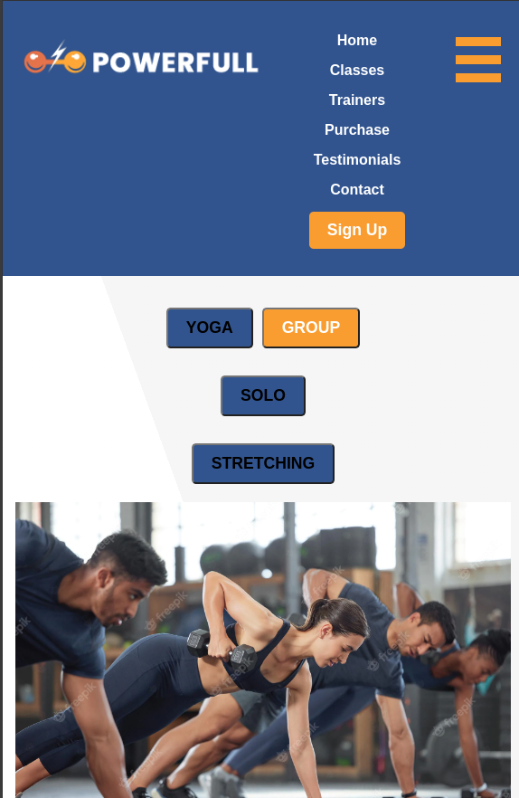
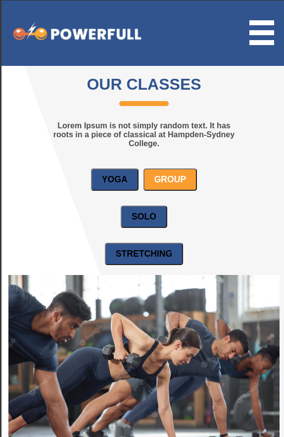